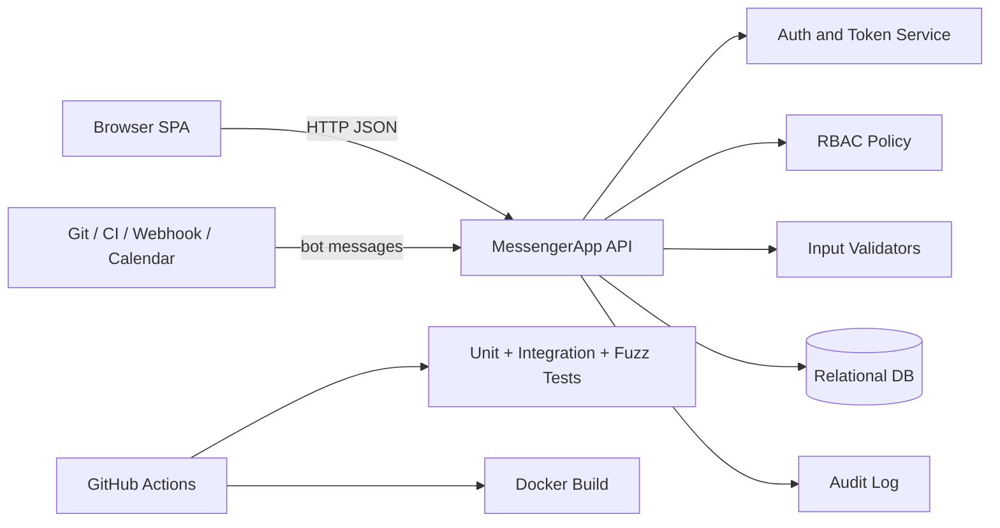
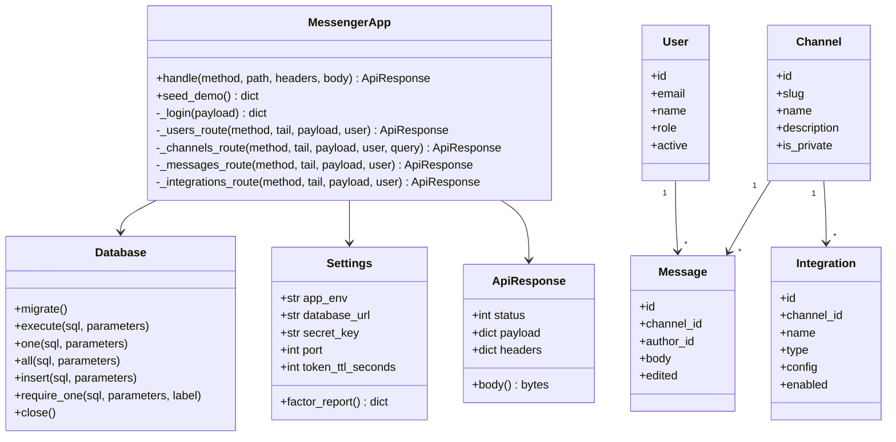
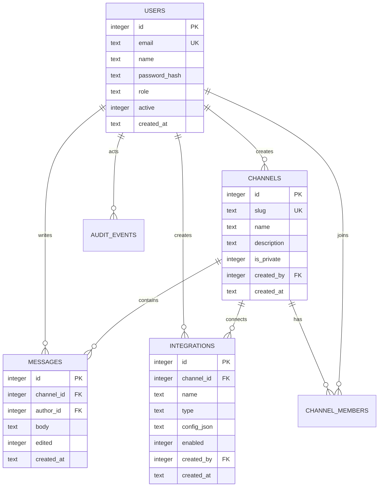
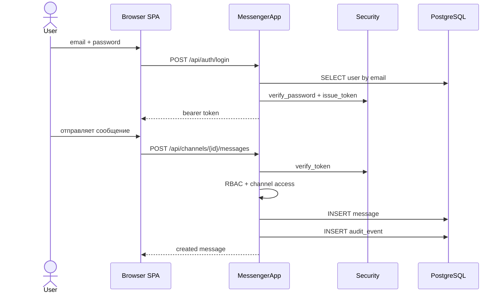
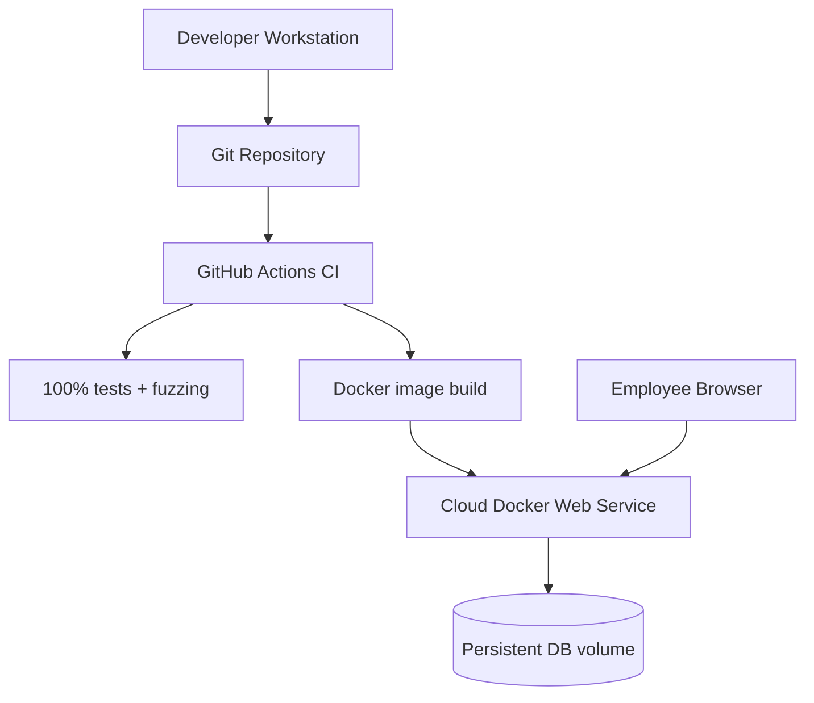

# UML и архитектура

## Клиент-серверная архитектура

Приложение построено как классическая трехзвенная клиент-серверная система:

- Presentation layer: SPA в `client/`, работает в браузере и обращается к `/api`.
- Application layer: Python backend в `server/`, маршрутизация, auth, RBAC, валидация и бизнес-правила.
- Data layer: реляционная PostgreSQL БД, подключаемая через `DATABASE_URL`.

## Component Diagram

## Class Diagram

## ER Diagram

## Sequence Diagram: вход и отправка сообщения

## Deployment Diagram

